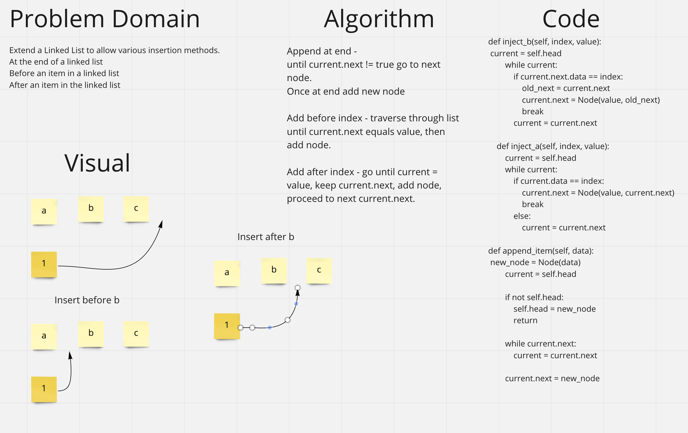
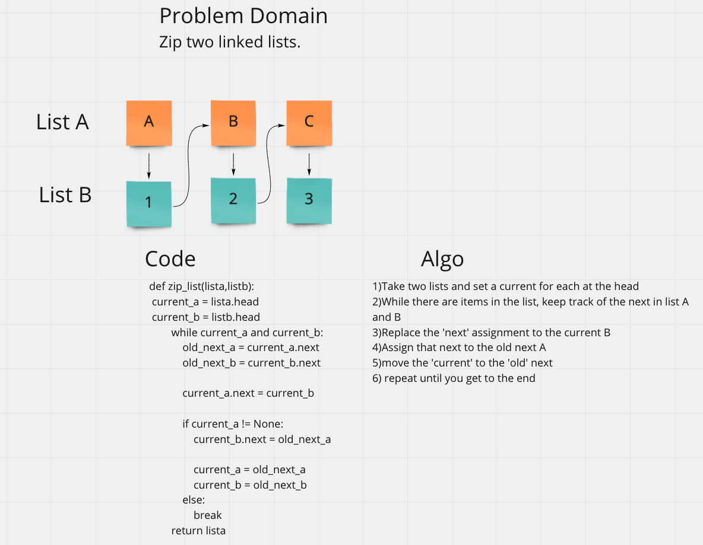
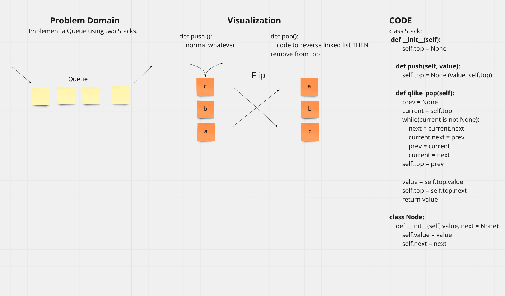

# Data Structures and Algorithms

## Language: `Python`

## Code Challenge6

## Code Challenge7

## Code Challenge8
### Challenge Summary
Zip up two seperate linked lists

###  Whiteboard Process

(resubmit)

# Stacks and Queues
Create stacks and queues

## Challenge
Create code to push, pop, peek, enquue, and dequeue

## Code Challenge11
# Challenge Summary
Implement a Queue using two Stacks.

## Whiteboard Process

## Approach & Efficiency
Reverse stack before removing item.

## Solution
See queueWithStacks.py
