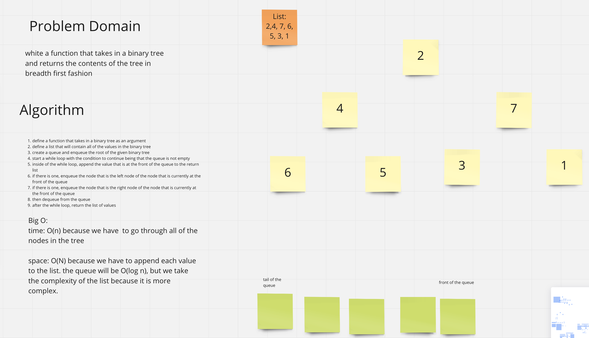

# Challenge Summary
Partner: Zach

Write a breadth first traversal method which takes a Binary Tree as its unique input. Without utilizing any of the built-in methods available to your language, traverse the input tree using a Breadth-first approach, and return a list of the values in the tree in the order they were encountered.

## Whiteboard Process

## Approach & Efficiency

- define a function that takes in a binary tree as an argument
- define a list that will contain all of the values in the binary tree
- create a queue and enqueue the root of the given binary tree
- start a while loop with the condition to continue being that the queue is not empty
- inside of the while loop, append the value that is at the front of the queue to the return list
- if there is one, enqueue the node that is the left node of the node that is - currently at the front of the queue
- if there is one, enqueue the node that is the right node of the node that is currently at the front of the queue
- then dequeue from the queue
- after the while loop, return the list of values

Big O:

time: O(n) because we have  to go through all of the nodes in the tree

space: O(N) because we have to append each value to the list. the queue will be O(log n), but we take the complexity of the list because it is more complex.
