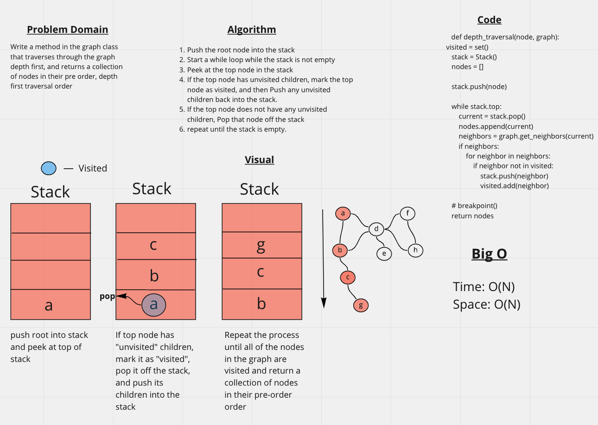

# Challenge Summary
Write a method in the graph class that traverses through the graph depth first, and returns a collection of nodes in their pre order, depth first traversal order

## Whiteboard Process

## Efficiency
Time: O(N)
Space: O(N)

## Solution
def depth_traversal(node, graph):
 visited = set()
    stack = Stack()
    nodes = []

    stack.push(node)

    while stack.top:
        current = stack.pop()
        nodes.append(current)
        neighbors = graph.get_neighbors(current)
        if neighbors:
            for neighbor in neighbors:
                if neighbor not in visited:
                    stack.push(neighbor)
                    visited.add(neighbor)

    # breakpoint()
    return nodes
