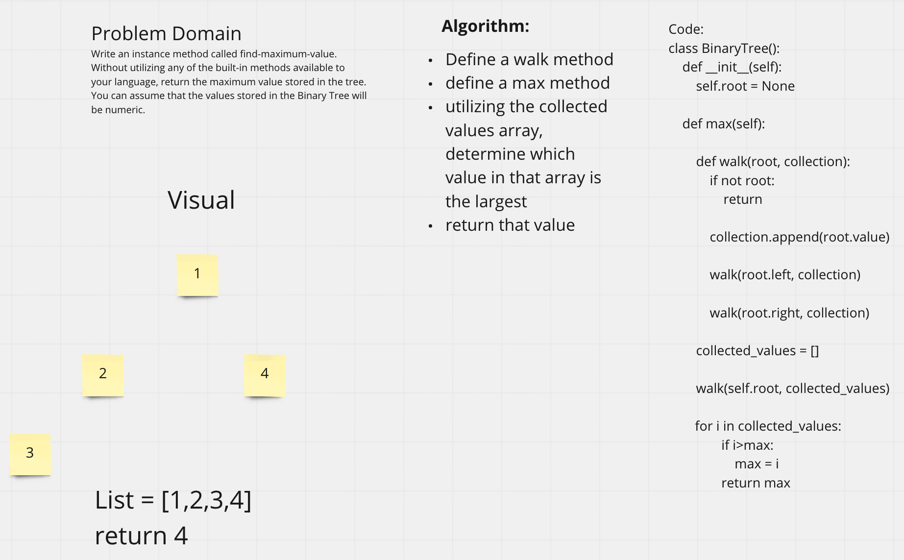

# Challenge Summary
Partner: Brian Lemon

Write an instance method called find-maximum-value. Without utilizing any of the built-in methods available to your language, return the maximum value stored in the tree. You can assume that the values stored in the Binary Tree will be numeric.

## Whiteboard Process

## Approach & Efficiency
We ran a pre-order collection on the Binary Tree, we then took the collection that ordinarily would be returned and do another loop for all there items while keeping track of the max. We then returned that max.

