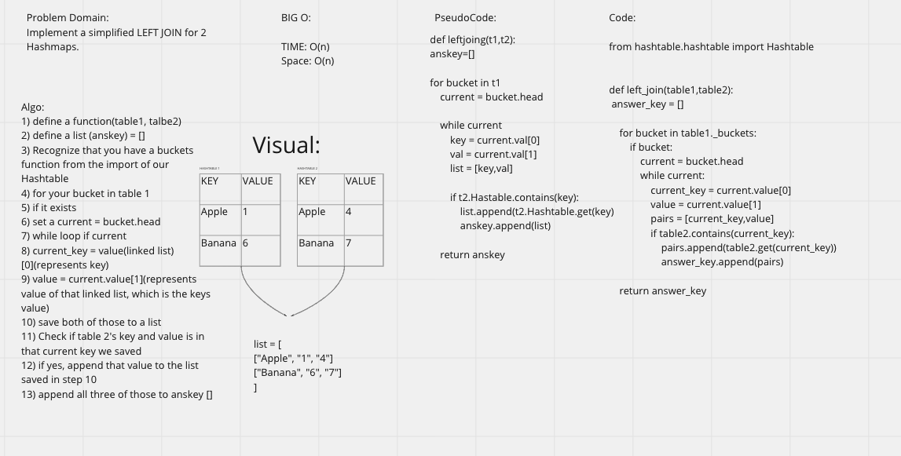

### Hashmap Left Join

Write a function that LEFT JOINs two hashmaps into a single data structure.

## Challenge

## Efficiency
BIG O:

TIME: O(n)
Space: O(n)

## Solution
Algo:
1) define a function(table1, talbe2)
2) define a list (anskey) = []
3) Recognize that you have a buckets function from the import of our Hashtable
4) for your bucket in table 1
5) if it exists
6) set a current = bucket.head
7) while loop if current
8) current_key = value(linked list)[0](represents key)
9) value = current.value[1](represents value of that linked list, which is the keys value)
10) save both of those to a list
11) Check if table 2's key and value is in that current key we saved
12) if yes, append that value to the list saved in step 10
13) append all three of those to anskey []
