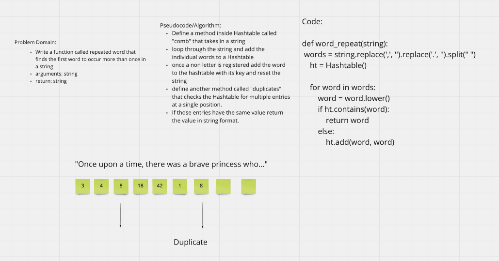

# Challenge Summary
Find the first repeated word in a book.

## Feature Tasks

Write a function called repeated word that finds the first word to occur more than once in a string

Arguments: string

Return: string

## Whiteboard Process

## Approach & Efficiency
We used a hashtable and the contains/add methods that we built into that to identify duplicates in a string.

Efficincy is O(N) worst case since we only need to go through the string once.

## Solution

def word_repeat(string):
    words = string.replace(',', '').replace('.', '').split(" ")
    ht = Hashtable()

    for word in words:
        word = word.lower()
        if ht.contains(word):
            return word
        else:
            ht.add(word, word)

