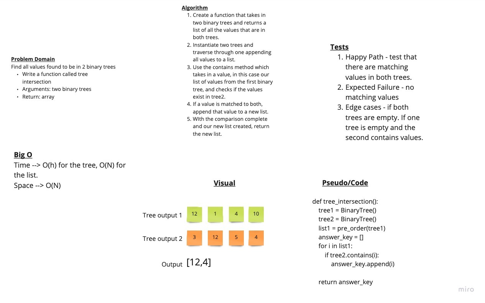

# Challenge Summary

Find all values found to be in 2 binary trees
Write a function called tree intersection
Arguments: two binary trees
Return: array

## Whiteboard Process

## Algo

- Create a function that takes in two binary trees and returns a list of all the values that are in both trees.
- Instantiate two trees and traverse through one appending all values to a list.
- Use the contains method which takes in a value, in this case our list of values from the first binary tree, and checks if the values exist in tree2.
- If a value is matched to both, append that value to a new list.
- With the comparison complete and our new list created, return the new list.

## Efficiency

Time --> O(h) for the tree, O(N) for the list.
Space --> O(N)

## Solution

def tree_intersection():
 tree1 = BinaryTree()
 tree2 = BinaryTree()
 list1 = pre_order(tree1)
 answer_key = []
 for i in list1:
  if tree2.contains(i):
   answer_key.append(i)

 return answer_key
