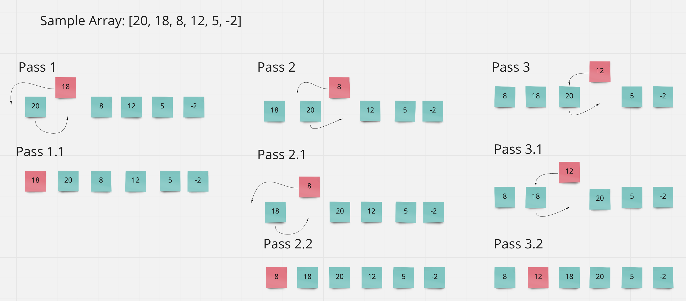

# Challenge Summary
Create a function that performs insertion sorting and create a blog that highlights the process.

## Whiteboard Process

## Approach & Efficiency
Time: This would be 0(n^2) becasue worst case it has to run the length of the array twice.

Space: O(1) because this is happening in place

## Solution
def insertion_sort(arr):
    for i in range(1,len(arr)):
        key = arr[i]
        j = i-1
        while j >= 0 and key < arr[j]:
            arr[j+1] = arr[j]
            j -= 1
        arr[j + 1] = key
    return arr
