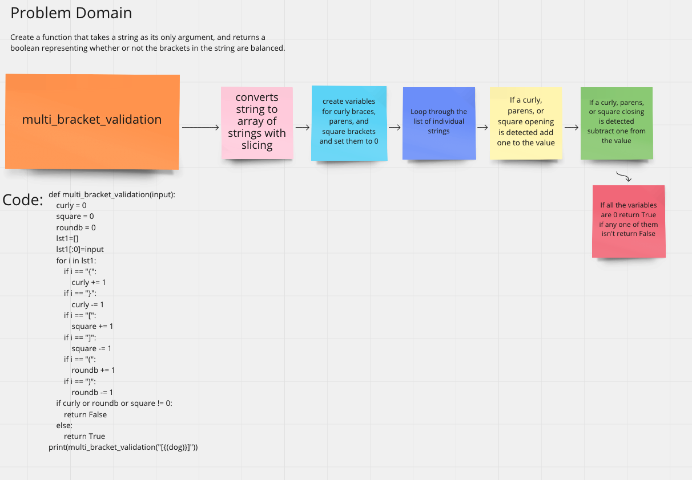

# Challenge Summary
Partner: Hunter Britten

Your function should take a string as its only argument, and should return a boolean representing whether or not the brackets in the string are balanced. There are 3 types of brackets:

Round Brackets : ()
Square Brackets : []
Curly Brackets : {}

## Whiteboard Process

## Approach & Efficiency
We converted the string into a list and then created a counter for each bracket type. When we have an opening bracket we add one to the counter and when we have a closing one we subtract one from the counter. If at any time we encounter a negative number we automatically return false. This prevents a closing bracket from coming before an opening one.

