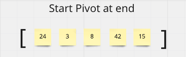
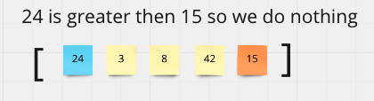
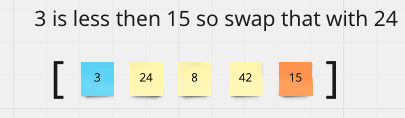
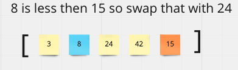
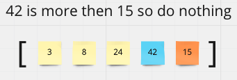
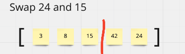
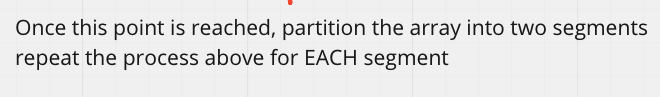

## Quick Sort

This is the quickest way to sort an array and is generally composed of two different fucntions - one called quick_sort and another called parition

#### Psuedocode

Here is some psuedocode that is generally cited to explain quick sor
```
  ALGORITHM QuickSort(arr, left, right)
    if left < right
        // Partition the array by setting the position of the pivot value
        DEFINE position <-- Partition(arr, left, right)
        // Sort the left
        QuickSort(arr, left, position - 1)
        // Sort the right
        QuickSort(arr, position + 1, right)

ALGORITHM Partition(arr, left, right)
    // set a pivot value as a point of reference
    DEFINE pivot <-- arr[right]
    // create a variable to track the largest index of numbers lower than the defined pivot
    DEFINE low <-- left - 1
    for i <- left to right do
        if arr[i] <= pivot
            low++
            Swap(arr, i, low)

     // place the value of the pivot location in the middle.
     // all numbers smaller than the pivot are on the left, larger on the right.
     Swap(arr, right, low + 1)
    // return the pivot index point
     return low + 1

```

We are given a sample array that we want to sort.















#### Python Code:

```
def insertion_sort(arr):
    for i in range(1,len(arr)):
        key = arr[i]
        j = i-1
        while j >= 0 and key < arr[j]:
            arr[j+1] = arr[j]
            j -= 1
        arr[j + 1] = key
    return arr


```

#### Space and Time Complexity:

**Time:** This would be 0(n^2) becasue worst case and O(LogN) on average

**Space:** O(1) because this is happening in place
