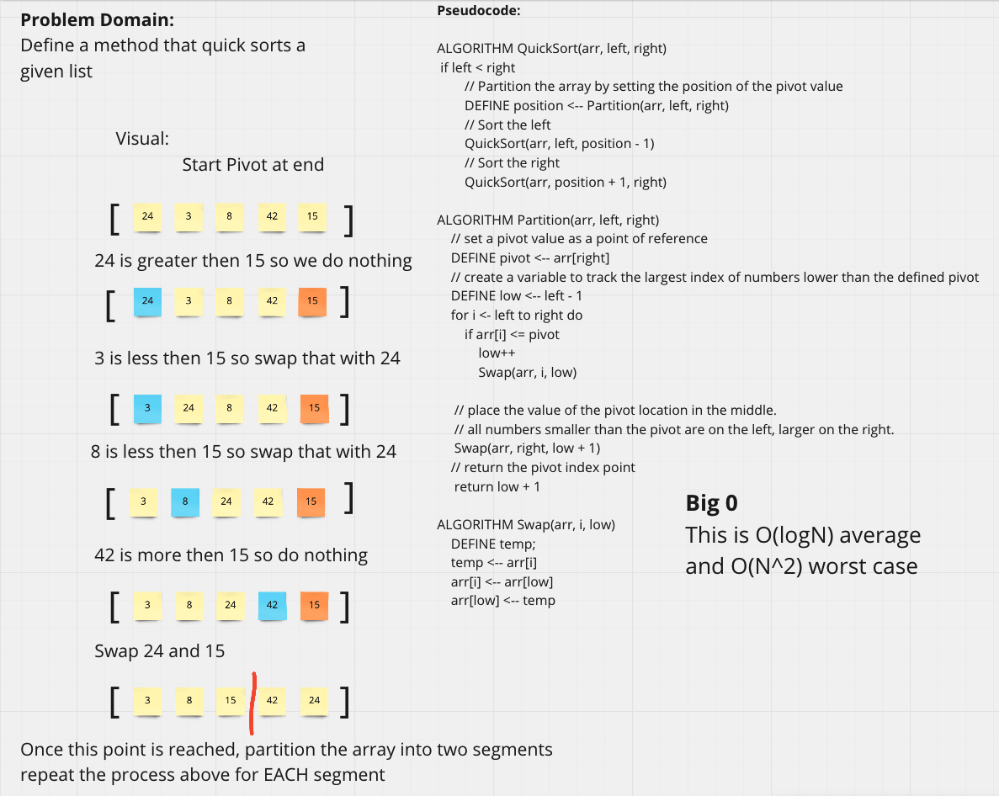

# Challenge Summary
Create a function that performs a quicksort and create a blog that highlights the process.

## Whiteboard Process

## Approach & Efficiency
Time: This would be 0(n^2) becasue worst case

## Solution
def partition(start, end, array):
    pivot_index = start
    pivot = array[pivot_index]

    while start < end:
        while start < len(array) and array[start] <= pivot:
            start += 1

        while array[end] > pivot:
            end -= 1

        if(start < end):
            array[start], array[end] = array[end], array[start]

    array[end], array[pivot_index] = array[pivot_index], array[end]

    return end

# The main function that implements QuickSort
def quick_sort(start, end, array):

    if (start < end):

        # p is partitioning index, array[p]
        # is at right place
        p = partition(start, end, array)

        # Sort elements before partition
        # and after partition
        quick_sort(start, p - 1, array)
        quick_sort(p + 1, end, array)

    return array
